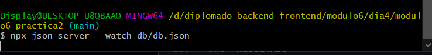
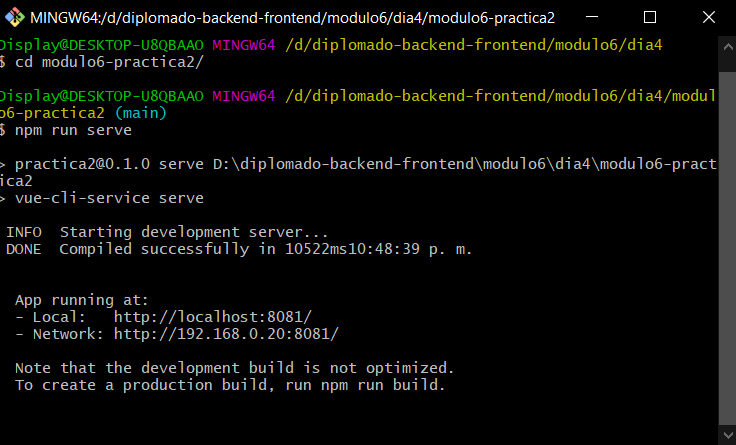
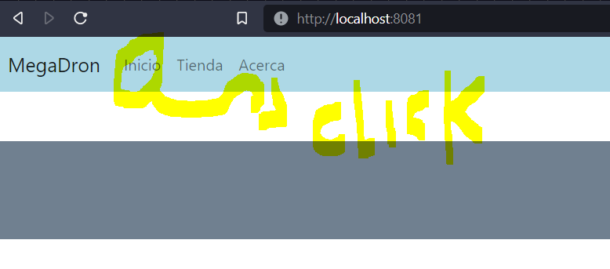
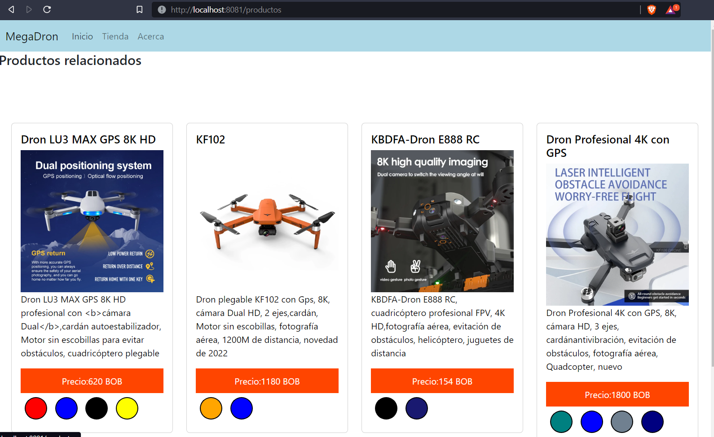
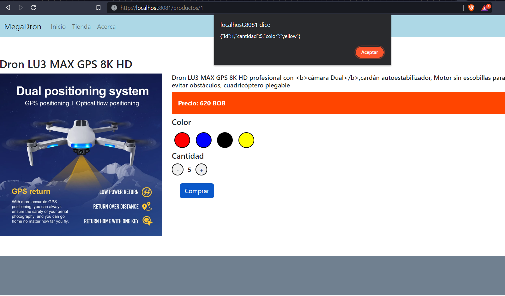

# MÓDULO 6 - VUEJS
# Integrantes
1. Edy Felix Tarqui Guarachi  CI:. 6154087 LP
2. Elmer Mamani Ticona        CI:. 8418037 LP

# PRACTICA 2:
1. Propósito: Demostrar los conocimientos adquiridos en la creación de un proyecto en
vuejs
Se pide realizar los mismos pasos pedidos en la practica1, esta vez usando Vue3.
2. Requerimientos:
- Cambiar el título de la página a: MegaDron
- Con menuColor cambiar el color de fondo del menubar
- Con footerColor cambiar el fondo del pie de pagina
- Mostrar en el menubar los menus del arreglo menus
- Con precioEstilos cambiar los estilos del div de precios
- Cambios seccion producto
- Cambios sección productos relacionados
- Comprar un producto
    En la sección de producto se deberá elegir el color y la cantidad del producto.
    Al presionar el botón de comprar deber mostrarse en un alert el el siguiente contenido:
    - id del producto
    - La cantidad
    - Color seleccionado

    Esta informacion debera estar en el objeto pedido
    ```
    pedido
    {
        id:null,
        cantidad: 1,
        color:null
    }
    ```

- Componentes: 
    Mínimamente deberá tener los siguientes componentes para: menú, pie de
    página, producto , y las tarjetas de producto que se muestran en la parte de producto
    relacionado
- Json-server:
    Se pide adicionalmente obtener los productos de un backend utilizando para
    ello la herramienta json-server con la siguiente data base:   db.json
    ```
        {
            "productos": [
            {
                "id":1,
                "imagen": "https://ae01.alicdn.com/kf/Sc3cc58f2a441419f970cc01f9e5358fbw/Dron-LU3-MAX-GPS-8K-HD-profesional-con-c-mara-Dual-card-n-autoestabilizador-Motorsin.jpg_Q90.jpg_.webp",
                "nombre": "Dron LU3 MAX GPS 8K HD",
                "descripcion": "Dron LU3 MAX GPS 8K HD profesional con <b>cámara Dual</b>,cardán autoestabilizador, Motor sin escobillas para evitar obstáculos, cuadricóptero plegable",
                "precio":"620",
                "colores": ["red", "blue", "black", "yellow"]
            },
            {
                "id":2,
                "imagen": "https://ae01.alicdn.com/kf/Hd59f72dd965d467dbbd499275a70b1d4z/Dron-plegable-KF102-con-Gps-8K-c-mara-Dual-HD-2-ejes-card-n-Motor-sin.jpg_Q90.jpg_.webp",
                "nombre": "KF102",
                "descripcion": "Dron plegable KF102 con Gps, 8K, cámara Dual HD, 2 ejes,cardán, Motor sin escobillas, fotografía aérea, 1200M de distancia, novedad de 2022",
                "precio":"1180",
                "colores": ["orange", "blue"]
            },
            {
                "id":3,
                "imagen": "https://ae01.alicdn.com/kf/S947d9284b5ea4531a1bec599a09a1f49K/KBDFA-Dron-E888-RC-cuadric-ptero-profesional-FPV-4K-HD-fotograf-a-a-rea-evitaci-n.jpg_Q90.jpg_.webp",
                "nombre": "KBDFA-Dron E888 RC",
                "descripcion": "KBDFA-Dron E888 RC, cuadricóptero profesional FPV, 4K HD,fotografía aérea, evitación de obstáculos, helicóptero, juguetes de distancia",
                "precio":"154",
                "colores": ["black", "midnightblue"]
            },
            {
                "id":4,
                "imagen": "https://ae01.alicdn.com/kf/S552326188797415ab6c729f850ab2639R/Dron-Profesional-4Kcon-GPS-8K-c-mara-HD-3-ejes-card-n-antivibraci-n-evitaci.jpg_Q90.jpg_.webp",
                "nombre": "Dron Profesional 4K con GPS",
                "descripcion": "Dron Profesional 4K con GPS, 8K, cámara HD, 3 ejes, cardánantivibración, evitación de obstáculos, fotografía aérea, Quadcopter, nuevo",
                "precio":"1800",
                "colores": ["teal", "blue", "slategrey", "navy"]
            }]
        }
    ```
- Boton comprar 
    El botón de comprar debe permanecer deshabilitado mientras no se tenga una cantidad
    mayor igual a 1 y un color seleccionado
- Nueva característica: 
    Agregar acción a las tarjetas: cuando se haga clic sobre una tarjeta de producto de la sección productos relacionados los datos del producto de la sección producto deberán mostrar los datos de la tarjeta sobre la cual se hizo clic.


### `PASOS DE INSTALACION`

## Instalacion vuejs3

-  npm install -g @vue/cli
-  vue --version
-  vue create modulo6-practica2


## Ejecucion de json-server servidor local de la base productos
- npm install -g json-server
- npx json-server --watch db/db.json

El resultado esperado es el siguiente:

### Compilamos codigo
```
npm run serve
```
El resultado esperado es el siguiente:


### Compilacion y minificacion para produccion
```
npm run build
```
### `RESULTADO `
una vez levantado el servidor ingresar menu inicio

listar y seleccionar productor:

informacion de producto:
